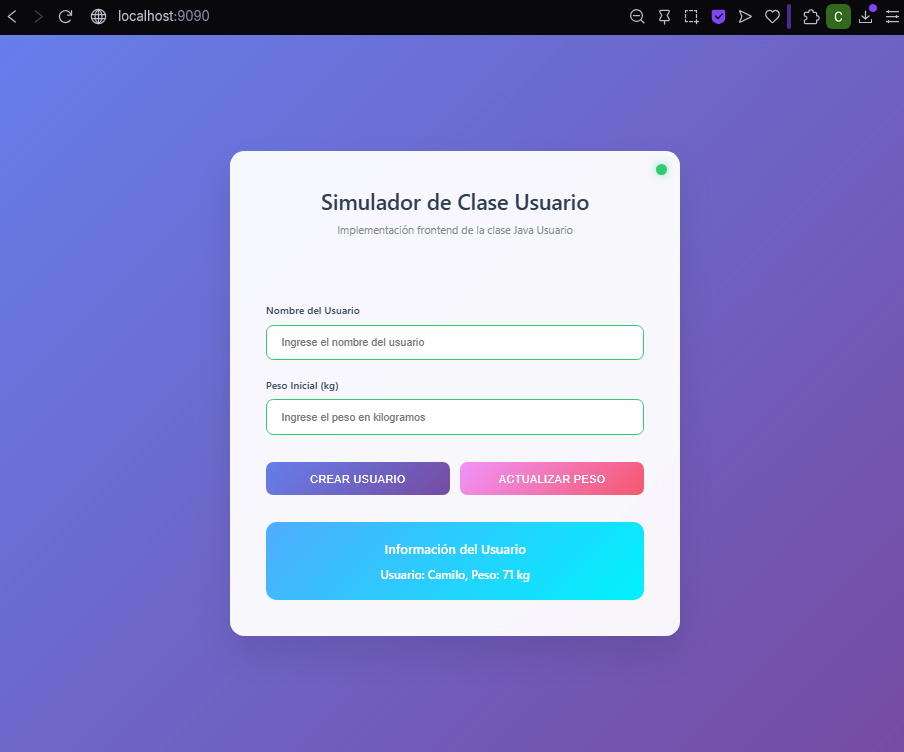
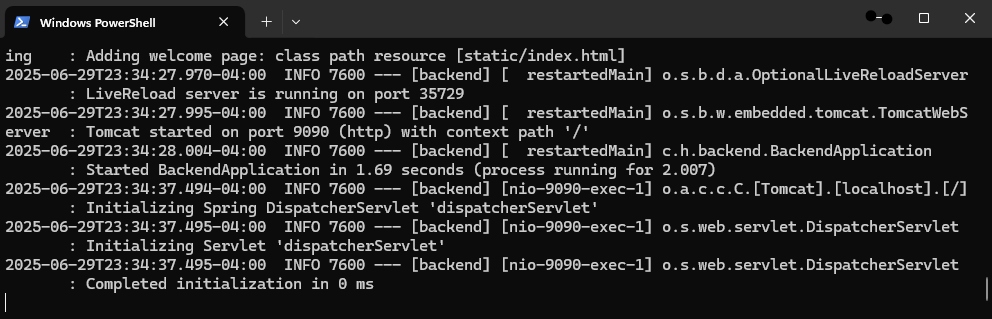
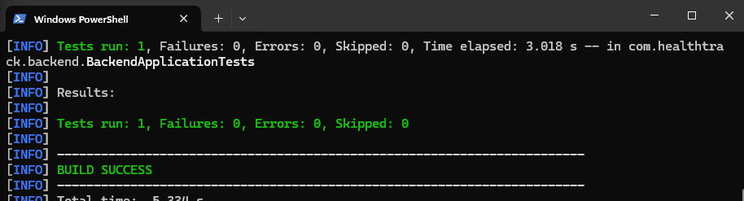

# Proyecto Evaluación Módulo 4 – HealthTrackTest 🩺

Este proyecto simula una plataforma de gestión de usuarios en el área de la salud. Permite registrar y actualizar datos de pacientes, conectando un frontend funcional con un backend en Java, incluyendo pruebas unitarias automatizadas con JUnit.

---

## 🚀 Tecnologías utilizadas

- **Backend:** Java 17 + Spring Boot
- **Frontend:** HTML, CSS, JavaScript
- **Testing:** JUnit 5 + Maven
- **CI/CD:** GitHub Actions

---

## 🧪 Ejecución del Proyecto

1. Clonar el repositorio:
   ```bash
   git clone https://github.com/TravailZamilo/healthtrack-testing
   ```

2. Iniciar el backend:
   ```bash
   cd backend
   mvn spring-boot:run
   ```

3. Abrir el archivo `frontend/index.html` en el navegador.

---

## 📁 Estructura del proyecto

```
healthtrack-testing/
│
├── backend/                 # API REST con Spring Boot
│   └── src/main/java/...    # Código fuente backend
│
├── frontend/               # Interfaz web
│   └── index.html           # Página principal
│
├── HealthTrackTest/        # Proyecto de pruebas unitarias con JUnit
│
└── .github/workflows/      # CI en GitHub Actions
```
---


## ✅ Pruebas Automatizadas

Desde la carpeta `backend`, ejecutar:

```bash
mvn test
```

Resultado esperado:
```
Tests run: 1, Failures: 0, Errors: 0
BUILD SUCCESS
```

---

## 🖼️ Evidencia Visual

### 1. Frontend funcional:


### 2. Backend ejecutándose correctamente:


### 3. Resultado de pruebas exitosas:


---

## 📋 Preguntas y Respuestas

**¿Qué se desarrolló?**  
Una aplicación completa con backend en Spring Boot, frontend funcional y pruebas automatizadas en Java.

**¿Qué se aprendió?**  
- Uso de JUnit para pruebas unitarias  
- Conexión entre frontend y backend  
- Estructura de proyectos en Java con Maven  
- Uso de Git y GitHub para control de versiones

## Reflexión Final del Proyecto

### ¿Qué aprendí desarrollando este proyecto?

Durante el desarrollo de este proyecto pude afianzar mis conocimientos en la creación de una arquitectura completa que integra frontend, backend y pruebas automatizadas. Aprendí a estructurar correctamente una API REST usando Spring Boot, a crear un cliente web funcional con HTML, CSS y JavaScript, y a conectar ambos extremos de manera efectiva. Además, reforcé el uso de herramientas como Postman para pruebas manuales y JUnit para pruebas automatizadas.

### ¿Qué desafíos enfrenté al integrar backend, frontend y pruebas?

Uno de los principales desafíos fue la sincronización entre las tecnologías utilizadas. Por ejemplo, asegurar que los endpoints del backend respondieran correctamente a las peticiones del frontend, y que los datos fueran consistentes. También fue un reto mantener una estructura de carpetas clara y ordenada, especialmente al vincular los resultados de pruebas con la interfaz. El control de versiones en GitHub también fue complejo en ciertos momentos, pero lo logré resolver con rebase y uso de stash.

### ¿Cómo asegurarías la calidad del software en un proyecto real?

Automatizando pruebas unitarias y funcionales desde el inicio del desarrollo. Además, incorporaría herramientas de CI/CD como GitHub Actions para ejecutar tests automáticamente con cada push. También es importante la documentación clara, seguimiento de errores y una buena gestión de versiones. La calidad se asegura desde el diseño, no solo al final del proceso.

### ¿Qué herramientas nuevas aprendiste a usar?

Aprendí a integrar Maven con Spring Boot, manejar dependencias y a ejecutar pruebas con JUnit de forma controlada. También reforcé el uso de PowerShell para la línea de comandos y comandos de Git como `stash`, `pull --rebase`, entre otros. Además, mejoré mi dominio del flujo completo de desarrollo y despliegue local.

### ¿Qué parte del proceso automatizarías con CI/CD?

Automatizaría la ejecución de pruebas con cada cambio en el repositorio (push o pull request). También incluiría la compilación del backend, verificación del frontend y despliegue automático a un entorno de pruebas. Así se detectan errores antes de llegar a producción.

---

## Objetivo del Proyecto

El objetivo fue desarrollar una aplicación completa de gestión de usuarios en el área de la salud, simulando un entorno real. Este sistema permite crear y actualizar usuarios desde una interfaz web, conectándose a una API REST desarrollada con Java y Spring Boot. Además, se integraron pruebas automatizadas con JUnit para validar el correcto funcionamiento del backend. La idea fue aplicar prácticas de calidad del software y generar un entregable funcional que demuestre conocimientos en programación, pruebas y despliegue.


---

## 👤 Autor

**Nombre:** Camilo Cáceres  
**GitHub:** [TravailZamilo](https://github.com/TravailZamilo)
